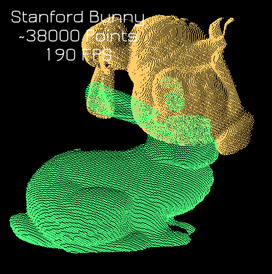
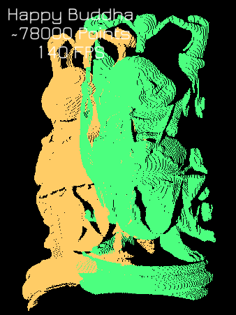
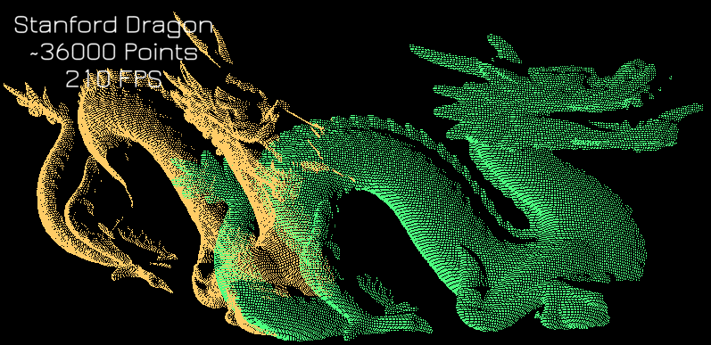
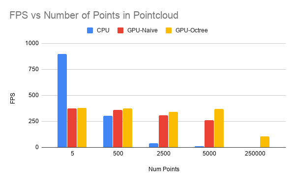

CUDA Scan Matcher via ICP - Octree Optimized 
===============================================================================

**University of Pennsylvania, CIS 565: GPU Programming and Architecture**

Dhruv Karthik: [LinkedIn](https://www.linkedin.com/in/dhruvkarthik/)

Tested on: Windows 10 Home, Intel(R) Core(TM) i7-8700 CPU @ 3.20GHz, 16GM, GTX 2070 - Compute Capability 7.5
____________________________________________________________________________________
   
____________________________________________________________________________________
<p align="center">
  
</p>

Table of contents
=================
  * [Scan Matching Algorithm](#scan-matching-algorithm)
  * [Results](#results)
  * [Octree Optimization](#sparse-octree-optimization)
  * [Performance Analysis](#performance-analysis)
  * [Build Instructions](#build-instructions)
  * [Running The Code](#running-the-code)
  
# Scan Matching Algorithm
An intuitive understanding of Scan Matching is best illustrated in this 11 second [video](https://www.youtube.com/watch?v=uzOCS_gdZuM).
Scan Matching seeks to align two similar pointclouds by finding the transformation between them. It does so via the iterative closest point algorithm outlined below in pseudocode:
```bash
#Aligns pointcloud A to pointcloud B
def scan_match(pointcloud A, pointcloud B):
  1. For each point in A, find the closest point in B
  2. Compute a 3-D transformation matrix that aligns the points (Use SVD & Least Squares Regression)
  3. Update all points in the target by the transformation matrix
  4. Repeat steps 1-3 until some epsilon convergence
  RETURN : Some Transformation matrix T
```
The key benefit from CUDA is in step 1. Finding the nearest neighbors synchronously takes far longer than finding nearest neighbors via some optimized datastructure like an octree. I implemented 3 versions: A CPU version, a Naive CUDA version, and an Octree version.  

# Results
<p align="center">
  
</p>

<p align="center">
  
</p>

<p align="center">
  
</p>

# Sparse Octree Optimization
A sparse octree is an optimized datastructure that allows for fast nearest neighbor calculations. It is represented as a tree in which each internal node has exactly eight children. We use octrees in order to subdivide our 3D space, ensuring that no *octant* has more than *n* points. If some node has more than *n* vertices, we recursively subdivide this node by splitting it into eight children, and redistributing the points among these 8 children. This speeds up nearest neighbor searches as now, we only need to search for neighbors within our octant. 
  <p align="center">
    
  </p>
  
  # Performance Analysis
  In order to test the varying number of points, I generated a 3D sinusoid with various widths, thereby increasing the number of points. 
  ## Increasing speed of Nearest Neighbor Search
  The table below illustrates the effect of each algorithm on the speed of nearest neighbor search. Clearly, the GPU-Octree performs NN the fastest, as it iterates only through points inside its octant. The Naive GPU iterates through all the points, but does so paralelly, and is therefore faster than the CPU that does so in a triple for loop sequentially.

**Number of points vs Time Taken (ms) for Nearest Neighbor Search (lower is better)**
  
| Num Points 	| CPU    	| GPU-Naive 	| GPU-Octree 	|
|------------	|--------	|-----------	|------------	|
| 5          	| 0      	| 5         	| 8          	|
| 500        	| 1268   	| 8         	| 3          	|
| 2500       	| 23000  	| 573       	| 164        	|
| 5000       	| 94000  	| 903       	| 193        	|
| 250000     	| 861000 	| 14000     	| 400        	|

  ## Effect of Increasing NN on framerate
  Below, we clearly see that the decrease in time across the algorithm directly contributes to an increase in framerate. Astonishingly, we see an over 1000% improvement over the CPU algorithm:
    <p align="center">
    
  </p>
  
  ## Build Instructions 
  ### Windows
  Taken from CIS 565 Getting Started Instructions
1. In Git Bash, navigate to your cloned project directory.
2. Create a `build` directory: `mkdir build`
   * (This "out-of-source" build makes it easy to delete the `build` directory
     and try again if something goes wrong with the configuration.)
3. Navigate into that directory: `cd build`
4. Open the CMake GUI to configure the project:
   * `cmake-gui ..` or `"C:\Program Files (x86)\cmake\bin\cmake-gui.exe" ..`
     * Don't forget the `..` part! This tells CMake that the `CMakeLists.txt` file is in the parent directory of `build`.
   * Make sure that the "Source" directory points to the directory `cuda-getting-started`.
   * Click *Configure*.
      * Select `Visual Studio 15 2017, Win641`.
        (**NOTE:** you must use Win64, as we don't provide libraries for Win32.)
      * *Optionally*, if the 2017 build ends being unstable, type in `v140` in the `Optional toolset to use` bar. This will use VS2015 build tools.
   * Click *Generate*.
5. If generation was successful, there should now be a Visual Studio solution
   (`.sln`) file in the `build` directory that you just created. Open this.
   (from the command line: `explorer *.sln`)
6. Build. (Note that there are Debug and Release configuration options.)
7. Run. Make sure you run the `cis565_` target (not `ALL_BUILD`) by
   right-clicking it and selecting "Set as StartUp Project".
   * If you have switchable graphics (NVIDIA Optimus), you may need to force
     your program to run with only the NVIDIA card. In NVIDIA Control Panel,
     under "Manage 3D Settings," set "Multi-display/Mixed GPU acceleration"
     to "Single display performance mode".

### Linux
It is recommended that you use Nsight. Nsight is shipped with CUDA. If you set up the environment path correctly `export PATH=/usr/local/cuda-10.0/bin${PATH:+:${PATH}}` (Note that simply typing the `export` command is a temporary change. The `PATH` variable won't be updated permanently. For permanent change, add it to your shell configuration file, e.g. `~/.profile` on Ubuntu), you can run Nsight by typing `nsight` in your terminal.

1. Open Nsight. Set the workspace to the one *containing* your cloned repo.
2. *File->Import...->General->Existing Projects Into Workspace*.
   * Select the `cuda-getting-started` directory as the *root directory*.
3. Select the *cis565-* project in the Project Explorer. Right click the project. Select *Build Project*.
   * For later use, note that you can select various Debug and Release build
     configurations under *Project->Build Configurations->Set Active...*.
4. If you see an error like `CUDA_SDK_ROOT_DIR-NOTFOUND`:
   * In a terminal, navigate to the build directory, then run: `cmake-gui ..`
   * Set `CUDA_SDK_ROOT_DIR` to your CUDA install path.
     This will be something like: `/usr/local/cuda`
   * Click *Configure*, then *Generate*.
5. Right click and *Refresh* the project.
6. From the *Run* menu, *Run*. Select "Local C/C++ Application" and the
   `cis565_` binary.
   
  ## Running the Code
  The file `main.cpp` should have the following at the top:
  ```C
#define VISUALIZE 1
#define STEP true
#define CPU false
#define GPU_NAIVE true
#define GPU_OCTREE false
#define MODEL true;
  ```
 To test the `GPU_NAIVE`, set it to True, and set `GPU_OCTREE` to False. Do the opposite to test `GPU_OCTREE`. `GPU_OCTREE` should be way faster, but is also a bit more sensitive to initialization. If you're having convergence difficulties with `GPU_OCTREE`, some rules of thumbs are:
  1. Tune the `#define MAX_PTS_PER_OCTANT` inside `octree.h`. 
